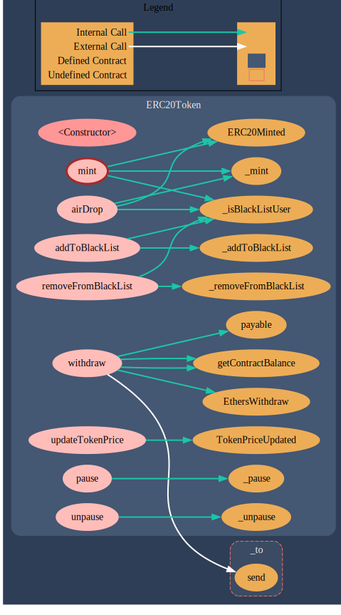
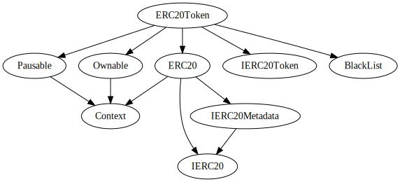

# ERC20-BOILER-PLATE Contract
Contract for ERC20 Token Contract

## Getting started

To make it easy for you to get started with Github, here's a list of recommended next steps.

## Table of Contents ##
1. [Setup](#setup)
2. [Commands](#commands)
3. [Contract Compile](#contract-compile)
4. [Truffle Config file](#truffle-config-file)
5. [Deploy On Local Network](#deploy-on-local-network)
6. [Deploy On Testnet Network](#deploy-on-testnet-network)

## Setup

1. System Setup 

You'll need node, npm and the Truffle Suite to set up the development environment. 

- [Node](https://nodejs.org/en/)
    - Version - 16.13.0
- [Truffle Suite](https://www.trufflesuite.com/)
    - Version - 5.5.3
- [Ganache](https://www.npmjs.com/package/ganache)
    - Version - ganache v7.4.4 (@ganache/cli: 0.5.4, @ganache/core: 0.5.4)

2. Wallet Setup

You will need a Blockchain wallet (Metamask) to deploy and test these smart contracts.

`Metamask` : -
          MetaMask is a popular cryptocurrency wallet known for its ease of use, availability on both desktops and mobile devices, the ability to buy, send, and receive cryptocurrency from within the wallet, and collect non-fungible tokens (NFTs) across two blockchains.

- To create a wallet on metamask install the Metamask extension on your web browser.
- Click on the Metamask extension and select Create a Wallet option from there.
- Setup a password for your Metamask login (Remember this is your Metamask login password not the account password).
- Tap to reveal the Secret Recovery Phrase and keep it safe with you.
- Confirm your Secret Recovery Phrase saved with you to add your account to Metamask.
- Now you can switch between Ethereum mainnet and other Test Networks.

3. .env Sample

```cmd
NAME=<Place your ERC20 Token Name here>
SYMBOL=<Place your ERC20 Token Symbol here>
TOKENPRICE=<Place your ERC20 Token Price here>
MNEMONIC=<Place your Ethereum address seed phrase here>
POLYGONSCANKEY=<Place your POLYGONSCAN API KEY>
ETHERSCANKEY=<Place your ETHERSCAN API KEY>
INFURA_API_KEY=<Place your Infura API KEY>
```
- NOTE-1:- SignUp/Login on Infura to get [INFURA_API_KEY](https://www.infura.io/)

- NOTE-2 :- Add metask extension on your browser to get [MNEMONIC](https://chrome.google.com/webstore/detail/metamask/nkbihfbeogaeaoehlefnkodbefgpgknn?hl=en)

- NOTE-3:- SignUp/Login on Etherscan to get [ETHERSCAN_API_KEY](https://etherscan.io/register)

## Commands

1. Truffle Installation command

- `Truffle` : -
          Truffle is a world-class development environment, testing framework and asset pipeline for blockchains using the Ethereum Virtual Machine (EVM), aiming to make life as a developer easier.

```console
npm install -g truffle
``` 
2. Ganache Installation command

-  `Ganache` : -
          Ganache is a private Ethereum blockchain environment that allows to you emulate the Ethereum blockchain so that you can interact with smart contracts in your own private blockchain

```console
npm install ganache --global
```
3. To install the required dependencies for project
 ```console
     npm install 
 ```
 
## Contract Compile

  ```console
    truffle compile --all
  ```

## Truffle Config File

This file would use your Mnemonic key and PolygonScan or Etherscan API KEY and Infura API KEY to deploy the smart contracts on local network as well Polygon and Test Network. 
These values will be picked up either from .env file explained above or the environment variables of the host system.

```js
require('dotenv').config()
const HDWalletProvider = require('@truffle/hdwallet-provider');
const MNEMONIC = process.env.MNEMONIC;
const POLYGONSCANKEY = process.env.POLYGONSCANKEY;
const ETHERSCANKEY = process.env.ETHERSCANKEY;
const INFURA_API_KEY = process.env.INFURA_API_KEY;
module.exports = {

  networks: {

    test: {
      host: "127.0.0.1",     // Localhost (default: none)
      port: 8545,            // Standard Ethereum port (default: none)
      network_id: "*",       // Any network (default: none)
    },

    goerli: {
      provider: () => {
        return new HDWalletProvider(MNEMONIC, 'wss://goerli.infura.io/ws/v3/' + INFURA_API_KEY)
      },
      network_id: 5, // eslint-disable-line camelcase
      timeoutBlocks: 200,
      skipDryRun: true,
    },

    mumbai: {
      provider: () =>
        new HDWalletProvider(
          MNEMONIC,
          `https://matic-mumbai.chainstacklabs.com/`
        ),
      network_id: 80001,
      timeoutBlocks: 200,
      skipDryRun: true,
    },
  },
  compilers: {
    solc: {
      version: "0.8.7",
      settings: {
        optimizer: {
          enabled: true,
          runs: 200,
        }
      }
    }
  },

  mocha: {
    enableTimeouts: false,
    before_timeout: 300000,
  },

  plugins: [
    "solidity-coverage",
    "truffle-plugin-verify",
  ],

  api_keys: {
    polygonscan: POLYGONSCANKEY,
    etherscan: ETHERSCANKEY,
  }
};

```
## Deploy On Local Network

Network Name - test

- To run smart contract on test first start

    `ganache`

    in another terminal

- To migrate the contracts 

    `truffle migrate --reset --network test`

    - This will use the migrations/2_migrate_ERC20.js file and deploy the ERC20Token contract.

    - This file would use your NAME, SYMBOL and TOKENPRICE fields from .env file and pass to the smart contract.

- To test the contracts 

    `truffle test --network test`

    - This will use the test/ERC20Token.test.js file and test the ERC20Token contract.

## Deploy On Testnet Network

Network Name - mumbai

- To migrate the contracts 

    `truffle migrate --network mumbai`

    - This will use the migrations/2_migrate_ERC20.js file and deploy the RolaCoaster contract.

        This file would use your NAME, SYMBOL and TOKENPRICE  fields from .env file and pass to the smart contract.

Network Name - goerli

- To migrate the contracts 

    `truffle migrate --network goerli`

    - This will use the migrations/2_migrate_ERC20.js file and deploy the RolaCoaster contract.

        This file would use your NAME, SYMBOL and TOKENPRICE  fields from .env file and pass to the smart contract.
    
## Test Case Coverage

To run the unit test case coverage on the smart contract we have used solidity-coverage npm package. The command to run the test coverage is:

`truffle run coverage`


File              |  % Stmts | % Branch |  % Funcs |  % Lines |Uncovered Lines |
------------------|----------|----------|----------|----------|----------------|
 contracts/       |      100 |    82.14 |      100 |      100 |                |
  BlackList.sol   |      100 |      100 |      100 |      100 |                |
  ERC20Token.sol  |      100 |    80.77 |      100 |      100 |                |
  IERC20Token.sol |      100 |      100 |      100 |      100 |                |
------------------|----------|----------|----------|----------|----------------|
All files         |      100 |    82.14 |      100 |      100 |                |


## Surya graph report

Surya is an utility tool for smart contract systems. It provides a number of visual outputs and information about the contracts' structure. Also supports querying the function call graph in multiple ways to aid in the manual inspection of contracts.

- Graph of ERC20Token contract


- Graph of Inheritance report


